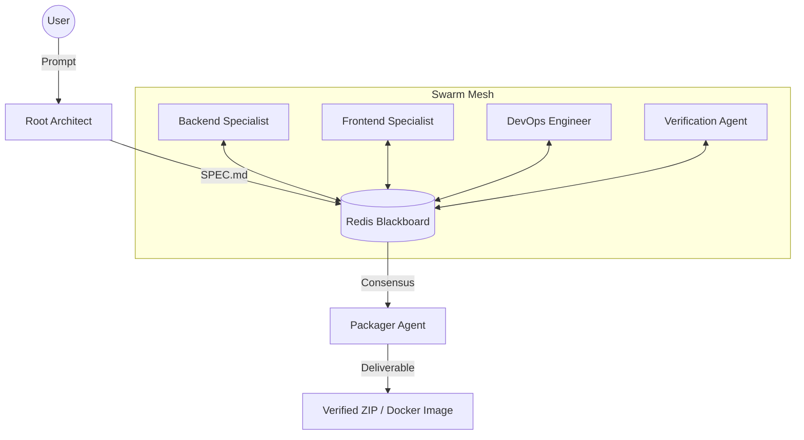

# ⌬ Chorus

### The Decentralized AI Agent Swarm for Production Scaffolding.

[](https://github.com/your-repo/chorus)
[](LICENSE)
[](https://svelte.dev/)
[](https://fastapi.tiangolo.com/)
[](https://www.langchain.com/langgraph)

---

## 1. Overview

**Chorus** is a high-performance, decentralized agent swarm designed to bridge the gap between "AI chat" and "Production Engineering." 

Unlike traditional hierarchical agent systems that rely on a single "supervisor" bottleneck, Chorus operates as an asynchronous mesh of specialists. Using a **Redis-backed Blackboard Architecture**, agents for Backend, Frontend, DevOps, and Quality Assurance collaborate in parallel, resolving dependencies through a formal **Claim & Verification Protocol**.

The result is not just a collection of code snippets, but a verified, deployable project architecture including full-stack logic, Docker orchestration, and a complete CI/CD pipeline.

---

## 2. The Core Innovation: Swarm Mesh vs. Supervisor

Most AI coding tools fail when project complexity exceeds the context window of a single supervisor agent. Chorus solves this through:

- **Decentralized Coordination:** No single agent owns the entire project. Agents subscribe to a shared blackboard to discover tasks and publish findings.
- **Adversarial Verification:** The system does not trust agent self-reporting. Every file write or architectural claim is independently verified by a separate verification logic to prevent hallucinations.
- **Circuit Breaker Protocol:** To prevent "infinite loop" token drain, Chorus monitors agent behavior. Erratic or failing agents are automatically quarantined, and the workspace is rolled back to the last known stable checkpoint.

---

## 3. Technical Architecture

### Swarm Topology
Chorus utilizes a state-machine-driven swarm where each agent is an independent node.



### The Verification Loop
1. **Claim:** An agent publishes a `Claim` (e.g., "REST API manifest is complete").
2. **Audit:** The Verification system runs adversarial checks against the file system.
3. **Consensus:** If valid, the claim is locked. If invalid, the workspace is rolled back and the agent is re-prompted with the failure trace.

---

## 4. Key Features

- **🚀 Svelte 5 & LangGraph:** Built on the cutting edge of web and AI orchestration.
- **🛠 Multi-Runtime Support:** Generates production-ready code for Spring Boot, FastAPI, Go, and Node.js.
- **🔍 RAG-Enhanced Knowledge:** Agents utilize a `pgvector` knowledge base to cite real documentation rather than hallucinating APIs.
- **⏱ Time-Travel Checkpoints:** Every major architectural move is checkpointed. Rewind the entire swarm to any point in the build process.
- **🛡 Enterprise Sandboxing:** Tools execute in isolated environments with strict file-system permissions.

---

## 5. Technology Stack

### Backend
- **Core:** Python 3.11+, FastAPI
- **Orchestration:** LangGraph (State-machine agents)
- **Blackboard:** Redis (Pub/Sub + State persistence)
- **Memory:** PostgreSQL + pgvector (RAG knowledge base)
- **LLM:** Optimized for MiniMax M2.7 / OpenAI GPT-4o

### Frontend
- **Framework:** Svelte 5 (Runes-based reactivity)
- **Styling:** Tailwind CSS 4.0
- **Real-time:** Server-Sent Events (SSE) for swarm telemetry
- **Visualization:** Custom CSS/SVG mesh rendering

---

## 6. Getting Started

### Prerequisites
- Docker & Docker Compose
- API Keys for MiniMax or OpenAI

### Installation
1. Clone the repository:
   ```bash
   git clone https://github.com/your-repo/chorus.git
   cd chorus
   ```

2. Configure environment:
   ```bash
   cp .env.example .env
   # Edit .env with your API keys
   ```

3. Launch the stack:
   ```bash
   docker compose up -d
   ```

4. Access the UI:
   Navigate to `http://localhost:5173` to start your first swarm.

---

## 7. Swarm Directives

Chorus supports real-time interaction during the build process:
- **`PAUSE`**: Halt a specific agent to review its current work-in-progress.
- **`WHISPER`**: Send a targeted instruction to one agent (e.g., "Use JPA for the persistence layer") without interrupting the rest of the swarm.
- **`FORK`**: Create a new project branch from a specific swarm checkpoint.

---

## 8. License

Distributed under the MIT License. See `LICENSE` for more information.

---

## 9. Acknowledgments
* Built in collaboration with the open swarm research community.
* Special thanks to the LangGraph and Svelte teams for the foundational primitives.

<p align="center">
  <i>"The next thing you ship is a sentence away."</i>
</p>
